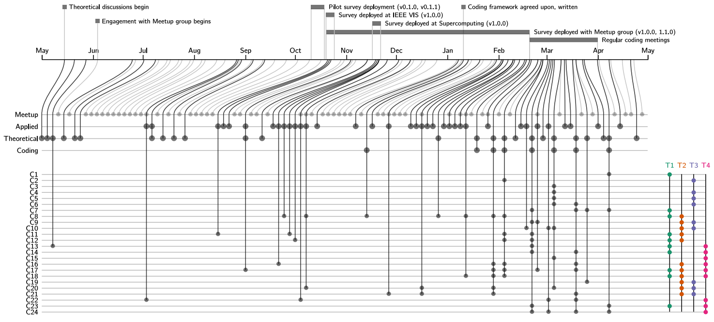

**Also known as "The Plushie Paper" (due to our unique survey compensation), we conducted a [survey](https://alex-r-bigelow.github.io/wrangling-survey/index.html) about how people describe their data. The results of the survey are available as an interactive summary [here](https://alex-r-bigelow.github.io/wrangling-survey/Responses.html?viewIndex=0&filters=wpA)**

**Abstract**: 
Many data abstraction types, such as networks or set relationships, remain unfamiliar to data workers beyond the visualization research community. We conduct a survey and series of interviews about how people describe their data, either directly or indirectly. We refer to the latter as latent data abstractions. We conduct a grounded theory analysis and develop a substantive theory that (1) interprets the extent to which latent data abstractions exist, (2) reveals the far-reaching effects that the interventionist pursuit of such abstractions can have on data workers, (3) predicts why and when data workers may resist such explorations, and (4) suggests how to take advantage of opportunities and mitigate risks through transparency about visualization research perspectives and agendas. To continue the discussion, we make our dataset open along with a visual interface for further exploration. 

### Papers

A. Bigelow, K. Williams and K. E. Isaacs, 
"[Guidelines For Pursuing and Revealing Data Abstractions](/people/kawilliams/papers/2020-bigelow-guidelines.pdf)"
 in IEEE Transactions on Visualization and Computer Graphics, vol. 27, no. 2, pp. 1503-1513, Feb. 2021, doi: 10.1109/TVCG.2020.3030355. [Presentation from VIS 2020](https://www.youtube.com/watch?v=DhPiHvtgtTI)
