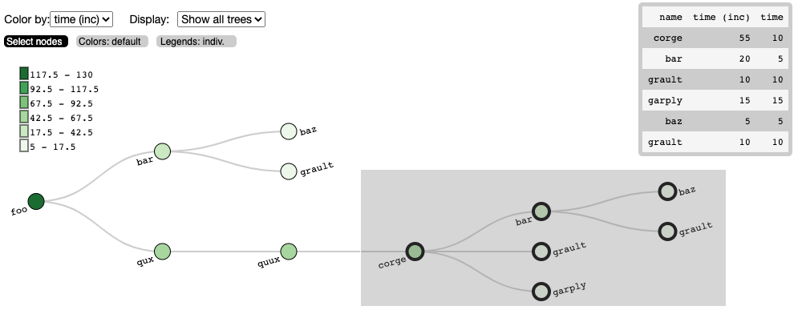

**I built an [interactive call tree visualization](https://hatchet.readthedocs.io/en/latest/user_guide.html#visualizing-the-data) to supplement the Hatchet library.**

Mentor: Stephanie Brink

**Description**: 
High-performance computer scientists instrument their code at specific areas with [Caliper](https://github.com/LLNL/Caliper) to gather performance data as their code runs, so that they can retroactively look at where slowdowns occurred. Then they open a Jupyter notebook and use the Python-based library called [Hatchet](https://github.com/hatchet/hatchet) to index the dataframes of their performance data and graph data. The users also want to see a representation of the calling context tree of the program (shown here on the left), which is an output that shows how functions called other functions and how long each function took to execute. To supplement the current terminal-like tree visualization in Hatchet from the previous slide, I built an interactive tree that gives users a way to explore the call tree and extract subtrees from the visualization back into the Jupyter notebook cells using [Roundtrip](https://github.com/hdc-arizona/roundtrip).

### Repositories

[Hatchet](https://github.com/hatchet/hatchet): Hatchet is a Python-based library that allows Pandas dataframes to be indexed by structured tree and graph data. It is intended for analyzing performance data that has a hierarchy (for example, serial or parallel profiles that represent calling context trees, call graphs, nested regions’ timers, etc.).
- [My forked version](https://github.com/kawilliams/hatchet) that contains examples of the tree visualizations (under `Roundtrip_Examples/`). 

[Roundtrip](https://github.com/hdc-arizona/roundtrip): An interface for loading Javascript (notably D3 visualizations) into Jupyter notebooks. Supports transferring data from Python Jupyter cells to Javascript -- and back. 
