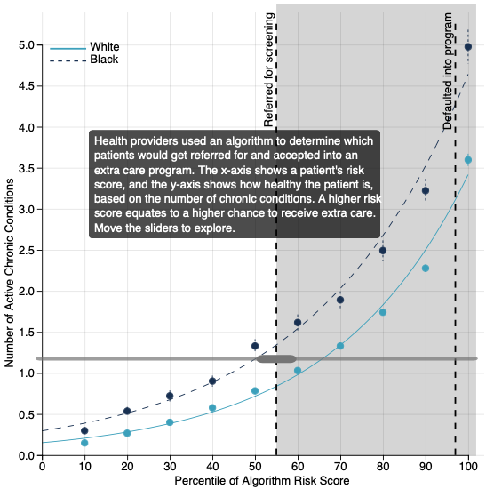

**I designed data visualizations for the Algorithmic Bias project as they published their [Algorithmic Bias Playbook](https://www.chicagobooth.edu/research/center-for-applied-artificial-intelligence/research/algorithmic-bias). This work was conducted through the Center for Applied Artificial Intelligence ([CAAI](https://www.chicagobooth.edu/research/center-for-applied-artificial-intelligence)) at the University of Chicago Booth School of Business.**

Supervisor: Emily Joy Bembeneck

**Description**: 
Algorithmic bias is everywhere and is difficult to spot. Work done by [Obermeyer et al](https://www.science.org/doi/10.1126/science.aax2342) shows that bias exists in commercial algorithms in health care systems, leading to Black patients being unfairly deemed "healthier" than equally sick White patients. This leads to a difference in care and has huge impacts on the health of these patients.

I created new versions of the line graphs published in the paper. These versions are static in the playbook, but are interactive in the web release (forthcoming). 

### Repositories/Websites

[Visualization Repository](https://github.com/kawilliams/bias-visualizations): the code for my visualizations.

[Algorithmic Bias headquarters](https://www.chicagobooth.edu/research/center-for-applied-artificial-intelligence/research/algorithmic-bias): the landing page for more information about the work on algorithmic bias. 
